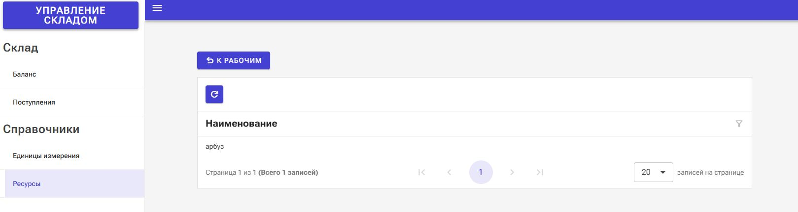
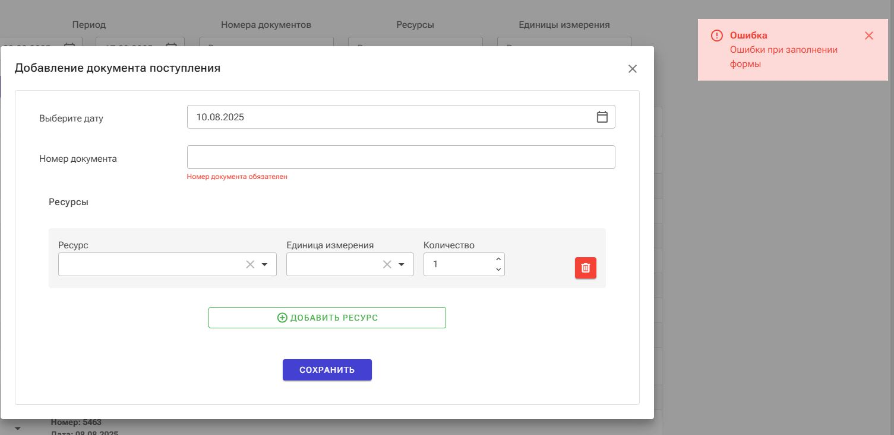

# SolforbTestTask

## Как собрать и запустить приложение:

1. Клонировать репозиторий

```git clone https://github.com/sergeyfedorov02/SolforbTestTask.git```

2. Перейти в рабочий каталог

```cd SolforbTestTask```

3. Сделать публикацию для работы web-сервера

```dotnet publish Server/SolforbTestTask.Server.csproj -p:PublishProfile=FolderProfile```

4. Перейти в каталог с исполняемым файлом и запустить его

```
cd Server\bin\Release\net9.0\publish
SolforbTestTask.Server.exe
```

Приложение будет запущено по адресу *http://localhost:5000/*


## Информация о проекте:
1. Для формирования начального проекта использовался Radzen Blazor Studio

*https://www.radzen.com/blazor-studio/*

2. Приложение является blazor-WebAssembly-приложением
3. Предполагается, что локально развернут сервер PostgreSQL. Развернуть можно в Docker,
   используя следующие команды

```
docker pull postgres
docker run -itd -e POSTGRES_USER=admin -e POSTGRES_PASSWORD=admin -p 5432:5432 --name postgresql postgres
```
Имя пользователя и пароль: admin/admin (Такие параметры указаны в строке подключения приложения)

4. Для доступа к базе данных используется Entity Framework и провайдер PostgreSQL. 
При запуске приложения создается база с именем *solforbDb*, если база с таким именем уже есть, 
то используется она.

## Демонстрация работы

Основная страница с отображением Баланса Склада


На данной странице настроена фильтрация


Присутствует возможность множественного выбора


Далее рассмотрим страницу "Ресурсы"


Попробуем добавить новый ресурс


Как мы видим, ресурс успешно добавлен


Попробуем добавить еще один ресурс, но появляется ошибка


Дело в том, что ресурс уже создан, просто находится в архиве



Также все записи можно редактировать при двойном нажатии на них.


Следует обратить внимание, что записи из рабочего пространства и из архива имеют различающиеся кнопки для перемещения


Аналогичная страница "Единицы измерения"


Рассмотрим теперь страницу "Поступления"


Здесь также применимы фильтры с множественным выбором


Далее приведена стандартная форма добавления нового "документа поступления"


При нажатии на кнопку "Добавить ресурс", появляется форма для заполнения, которую можно удалить 


При попытке сохранить документ с незаполненными полями, высвевится соответствующая ошибка



Добавим новый "документ поступления"


Как мы видим, он был успешно добавлен и появился в списке


Также можно редактировать документы поступления при двойном нажатии


Отредактируем созданную ранее запись


Посмотрим на изменение "Баланса" для всего склада


